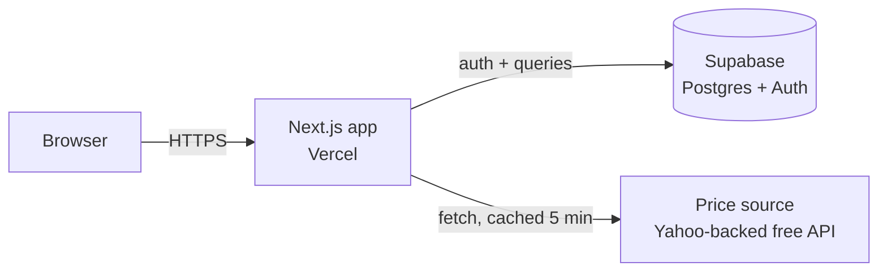

# Architecture — NiveshLoop

## 1. Stack (all free-tier)

| Layer | Choice | Why |
|---|---|---|
| Frontend + backend | Next.js 14+ (App Router, TypeScript) | One repo, one deploy target — simplest for a solo build |
| Styling | Tailwind CSS | Fast to build alone, no design system to maintain |
| Database + Auth | Supabase (Postgres + built-in auth) | Free tier covers this project's scale; skip building your own auth |
| Hosting | Vercel (frontend + API routes) | Free tier, zero-config Next.js deploys |
| Price data | Free Yahoo-Finance-backed NSE/BSE wrapper (see §4) | No API key, no broker account required, explicitly licensed for educational use |

No separate backend server — Next.js API routes under `src/app/api/` are the entire backend.

## 2. System overview



- The browser never talks to the price source or Supabase directly except through Supabase's client SDK for auth — all trade/lesson logic goes through Next.js API routes so business rules (e.g., "can't buy more than your cash balance") live server-side, not in the client.

## 3. Data model

```sql
-- see supabase/schema.sql for the runnable version

users            -- managed by Supabase Auth, referenced by id
portfolios       -- one per user: id, user_id, cash_balance, created_at
holdings         -- portfolio_id, symbol, qty, avg_price
transactions     -- portfolio_id, symbol, side (buy/sell), qty, price, had_stop_loss, created_at
lessons          -- id, slug, title, body_md, order_index, unlocks_action
lesson_progress  -- user_id, lesson_id, completed_at
insights         -- user_id, kind, message, computed_at
```

Notes:
- `unlocks_action` on `lessons` is a simple string enum (`first_trade`, `stop_loss_nudge`, `diversify_check`, etc.) — the frontend checks this to decide whether to show a nudge on the trade form. Don't over-engineer this into a rules engine for v1; a switch statement is fine.
- `insights` are precomputed (e.g., on a cron or on-demand when the user opens the dashboard) rather than computed live on every request — keep it cheap.

## 4. Price data strategy

Delayed data is a *feature choice*, not a limitation — this is a simulator, so 5-15 minute-old prices are honest and legally simpler than claiming real-time data.

- Source: a free, keyless REST wrapper around Yahoo Finance data covering NSE (`.NS` suffix) and BSE (`.BO` suffix) symbols.
- Cache every symbol's last-fetched price + timestamp in Supabase (a simple `price_cache` table: `symbol`, `price`, `fetched_at`). On a price request, serve from cache if `fetched_at` is under 5 minutes old; otherwise refetch.
- This avoids hammering the free source and keeps the app fast even if the source is briefly unavailable — never let a price-fetch failure block someone from viewing their portfolio; fall back to the last cached price and show its age.
- Always display a "prices delayed, last updated Xm ago" label next to any price. This isn't just honesty — it's what keeps this firmly in "educational simulation" territory rather than something requiring real market-data licensing.

## 5. API routes (v1)

| Route | Method | Purpose |
|---|---|---|
| `/api/prices?symbol=RELIANCE` | GET | Cached (or freshly fetched) delayed price |
| `/api/trade` | POST | Execute a simulated buy/sell against the user's portfolio |
| `/api/lessons` | GET | List lessons + user's completion status |
| `/api/lessons/[id]/complete` | POST | Mark a lesson complete, unlock its action |
| `/api/insights` | GET | Return the user's current behavioral insights |

All routes require an authenticated Supabase session; validate server-side, never trust client-submitted user IDs.

## 6. Folder structure

```
niveshloop/
├── AGENTS.md
├── docs/
│   ├── PRD.md
│   ├── ARCHITECTURE.md
│   └── PHASES.md
├── supabase/
│   └── schema.sql
├── src/
│   ├── app/
│   │   ├── layout.tsx
│   │   ├── page.tsx
│   │   ├── globals.css
│   │   └── api/
│   │       ├── prices/route.ts
│   │       └── trade/route.ts
│   ├── lib/
│   │   ├── supabase.ts
│   │   └── prices.ts
│   └── types/
│       └── index.ts
├── package.json
├── tailwind.config.ts
├── tsconfig.json
└── .env.example
```

## 7. Environment variables

```
NEXT_PUBLIC_SUPABASE_URL=
NEXT_PUBLIC_SUPABASE_ANON_KEY=
SUPABASE_SERVICE_ROLE_KEY=      # server-side only, never exposed to the client
PRICE_API_BASE_URL=             # the free price-data wrapper's base URL
```

## 8. Deployment

1. Push repo to GitHub.
2. Create a Supabase project (free tier), run `supabase/schema.sql` in its SQL editor.
3. Import the repo into Vercel, set the environment variables above, deploy.
4. No servers to manage, no cron infrastructure needed for v1 — price refresh happens lazily on request.

## 9. Design direction (for whoever builds the UI)

Avoid the generic AI-app look (dark mode + one neon accent, or cream background + terracotta accent). This product's subject is *trust and calm decision-making with real money on the line (even if simulated)* — palette and type should reflect steadiness, not hype. Suggested starting point: a muted deep-teal/forest primary, warm off-white background, a grounded serif or humanist sans for headings, plenty of whitespace. Treat the "delayed data" and "simulation" labels as first-class UI elements, not fine print — they're part of the product's honesty, not a legal afterthought.
